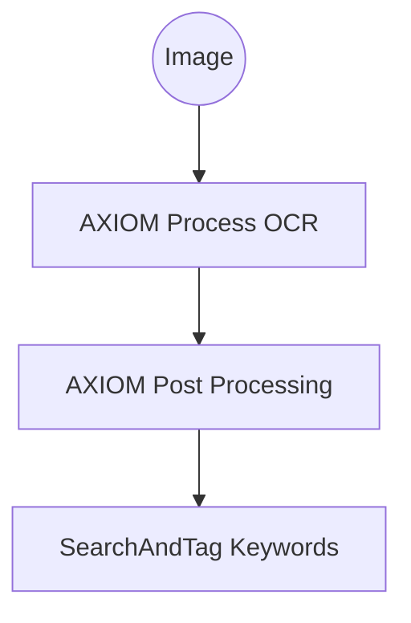
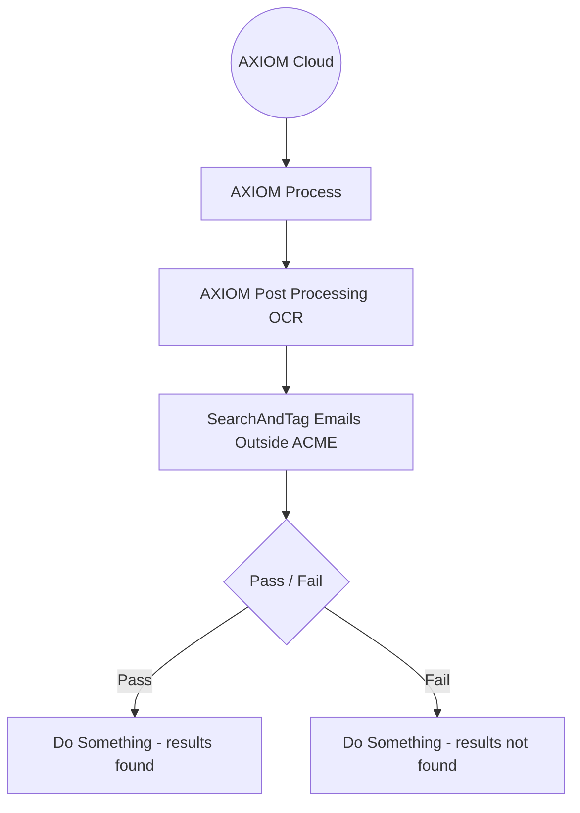
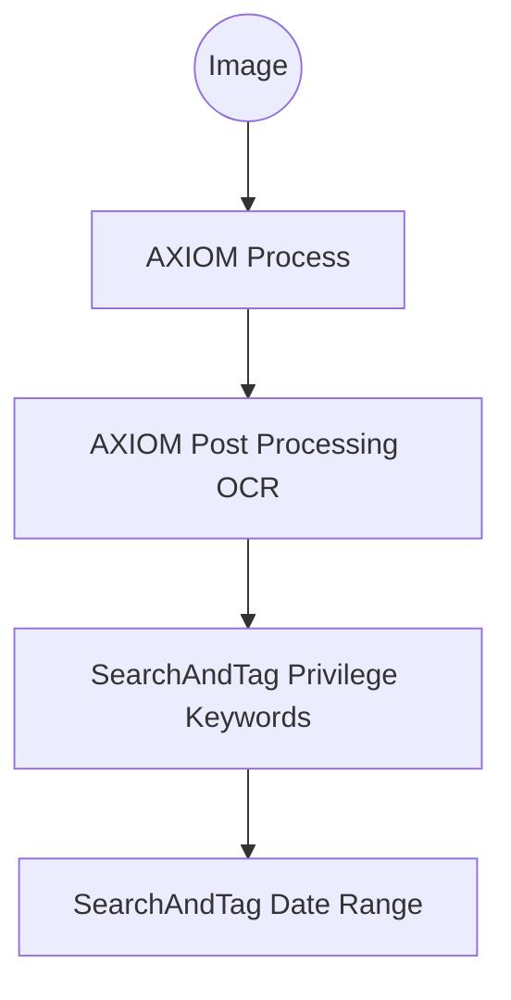

# Search and Tag
Use SearchAndTag.exe to sample your AXIOM Cases for text, date ranges and optionally tag them. Sreamline your tagging by incorporating SearchAndTag with Magnet AUTOMATE. 

## System Requirements
Any version of 64-Bit Microsoft Windows with support for .NETFramework Version v4.0.

## Required Parameters
String values must be in quotations if spaces are used.
| Parameter | Value |  Description  |
|--|--|--|
| `CasePath` | string | Path to locate .mfdb file. Account executing process must be able to read Case.mfdb. Write access required to create tags.
| `Name` | string | Name of tag(s) to create. Use `@value` for string(s) in `Value`, Example: `"Keyword - @value"`. Not required if `-SearchOnly` is used.|
| `Field` | string | AXIOM Case field. See field examples below. |
| `MatchType` | string | `BeginsWith`, `EndsWith`, `Contains`, `NotContains`, `Equals`, `NotEquals`, or `RegEx`. |
| `Value` | string | Search string, regular expression or file path. Separate each value by comma in CLI. You can refrence a keyword list file. |


## Optional Parameters

| Parameter | Value | Description |
|--|--|--|
| `SearchOnly` | switch | Search function only. Will not crate tag(s). Read Only Mode. |
| `Color` | string | `Green`, `Red`, `Yellow`, `Orange`, `Violete`, `Blue`, `LightBlue`, `Pink` or `Random`. Green is default if not provided. |
| `EmptyTag` | switch | Creates tag even if no artifacts are found. |
| `IncludeNoDates` | switch | For use with `-Field "DATE-RANGE"` only. Includes artifacts with no Created, Last Acccessed or Last Modified dates. |
| `NoResultsFail` | switch | Exit with failure (exit code 1) if no results are found. |
| `LogFile` | string | Full file path to save a logfile with results. |
| `Version` | switch | Output version. |
| `Help` | switch | Output help and examples. |


## Field Examples
Generally any [string] attribute listed under "Artifact Information" in the AXIOM Artifacts right pane can be used to target the field.

Different file systems and file types can produce various fields, always sample cases with similar data found in production and take note of the fields you are most interested in.

ℹ️ Integer and float (such as size, skin tone percentage and geolocation) attributes are currently not supported.

### Common Field Examples
| Field | Description |
|--|--|
| `Filename` | The file name parsed from the file system. |
| `File name` | Some artifacts such as pictures and video use "File name" attribute instead of "Filename." See the AXIOM Artifact Refrence inside the AXIOM Examine help menu. |
| `Preview` | The transcribed text as displayed in the PREVIEW pane. |
| `Exif data` | Extracted raw exif data. |
| `MD5 Hash` | The calculated MD5 hash during processing. |
| `SHA1 Hash` | The calculated SHA1 hash during processing. |
| `Event Data` | Windows event log. |
| `Activity Type` | Windows timeline activity types. |
| `Authors` | Microsoft Office documents authors. |
| `URL` | Any Web artifact URL. |
| `Artifact group` | Artifact group as shown in artifact view left pane. |
| `Artifact type` | Artifact type as shown in Artifact Information. |


### Email Field Examples
Email attributes vary from all mail providers. The following examples are used with Outlook Mail.

| Field |
|--|
| `Sender Name` |
| `Recipients` |
| `Subject` |
| `Body` |
| `Folder Name` |
| `Headers` |
| `Importance` | 


### Dates Fields
| Field | String Value | Desciption |
|--|--|--|
| `DATE-RANGE` | `<ISO-8601>` to `<ISO-8601>` | Searches artifacts with parsed dates displayed as Created, Last Acccessed and Last Modified. This will not search dates in Exif Data.  |
| `DATES` | `null` | Searches for any artifact without parsed dates. |

# CLI Eamples
## Search Only
The folowing example will search all transcribed text for multiple values and display results. Tags will not be created because `-SearchOnly` is used.

```bat
SearchAndTag.exe -CasePath "C:\Cases\OWL_USB" -SearchOnly -Field "Preview" -MatchType Contains -Value "eggs, nest, owl"
```

## Create and Associate One Tag 
The following example will search and associate a tag will all search values.
  
```bat
SearchAndTag.exe -CasePath "C:\Cases\OWL_USB" -Name "My Tag" -Color Green -Field "Preview" -MatchType Contains -Value "eggs, nest, owl"
```

## Create and Associate Multiple Tags
The following example will search and create a tag for each search value found.

```bat
SearchAndTag.exe -CasePath "C:\Cases\OWL_USB" -Name "My Tag - @value" -Color Green -Field "Preview" -MatchType Contains -Value "eggs, nest, owl"
```

## Create Empty Tags
The examples above will only create tags if results are found. The following example will create a tag even if no results are found.
  
```bat
SearchAndTag.exe -CasePath "C:\Cases\OWL_USB" -Name "My Tag - @value" -EmptyTag -Color Green -Field "Preview" -MatchType Contains -Value "eggs, nest, owl, hooter"
```

## Keyword List Files
You use a keyword list file (one word per line) by providing the full path to the file in `-Value`.
  
```bat
SearchAndTag.exe -CasePath "C:\Cases\OWL_USB" -Name "Narcotics Keywords" -Color Green -Field "Preview" -MatchType Contains -Value "C:\keywords\narcotics.txt"
```

## Date Rangeages
Magnet AUTOMATE users can take advantage of the "Date Range Selector" browser extension for Edge and Chrome. Multiple date ranges can be separated by comma.

[Microsoft Edge Extension](https://microsoftedge.microsoft.com/addons/detail/date-range-selector/mcddfkimiglkbnhiicacnipdcnkcflmi)

[Google Chrome Extension](https://chromewebstore.google.com/detail/date-range-selector/hnkjadegpmnecilgopkeidjcpmebidna)

### Parsed Dates Only
The following example will search all artifacts within the date ranges parsed by AXIOM process.
 
```bat
SearchAndTag.exe -CasePath "C:\Cases\OWL_USB" -Name "Date Range" -Color Green -Field "DATE-RANGE" -MatchType Contains -Value "2005-03-23T11:38:00-08:00 to 2005-03-23T11:39:59-08:00"
```

### Parsed Dates Including No Dates
If you wish to include artifacts with no dates in the same tag, the following will repeat the above example and add `-IncludeNoDates`.

```bat
SearchAndTag.exe -CasePath "C:\Cases\OWL_USB" -Name "Date Range" -Color Green -Field "DATE-RANGE" -MatchType Contains -Value "2005-03-23T11:38:00-08:00 to 2005-03-23T11:39:59-08:00" -IncludeNoDates
```

### No Dates Only
The following example will tag all artifacts with no dates.

```bat
SearchAndTag.exe -CasePath "C:\Cases\OWL_USB" -Name "No Dates" -Color Green -Field "DATES" -MatchType Contains -Value "null"
```

## PowerShell IDE Sampling
Integrated Scripting Enviroments such as PowerShell ISE and Visual Studio Code can use the following PowerShell snippet for `-Field` and `-Value` testing. The output will be dispalyed in the IDE console.

``` PowerShell
# This script is meant to be used in an IDE for sampling results.
# Make sure any values with spaces are wrapped in quotes.

$SearchAndTag = "C:\Tools\SearchAndTag\SearchAndTag.exe"

$params =(
    "-CasePath", "`"C:\Cases\OWL_USB`"",
    "-Field", "`"Preview`"",
    "-MatchType", "contains",
    "-Value", "`"owl, owl, eggs`"",
    "-SearchOnly"
)
Write-Host "Starting SearchAndTag.exe...`n "
& $SearchAndTag $params

```
# Magnet AUTOMATE Workflow Examples
Search and Tag requires an AXIOM Case (Case.mfdb) so SearchAndTag.exe must be executed after AXIOM Process and any Post Processing such as OCR in order to locate hits in OCR transcriptions.


## Example 1 - Custom Field
You can create a custom input field to enter case relative keywords during case creation. If a custom field is left blank (-Velue is empty) then SearchAndTag.exe will exit with code 0 to prevent workflow failures.

In this example, a custom input field in cases named "Keywords" has resulted in the variable `${CASE_KEYWORDS}`. 


**Note:** As of Magnet AUTOMATE 4.3 custom fileds with hard returns are not carried over into workflow variables. Entering keywords in custom fields must be entered as comma separated values. Keyword list files can be one word per line.




``` PowerShell
# PowerShell Application Wrapper for Magnet AUTOMATE example.
# SearchAndTag - Keywords

$application_name = "Search and Tag"
$application_path = "C:\Tools\SearchAndTag\SearchAndTag.exe"
$success_exit_code = 0

$params = @(
    "-CasePath", "`"${OUTPUT_PATH}\..\AXIOM_Process`"",
    "-LogFile", "`"${OUTPUT_PATH}\log.txt`"",
    "-Name", "`"Keyword - @value`"",
    "-Color", "Random",
    "-Field", "`"Preview`"",
    "-MatchType", "contains",
    "-Value", "`"${CASE_KEYWORDS}`""
)

Write-Host "[$application_name] Starting process."
$process = Start-Process -FilePath $application_path -ArgumentList $params -NoNewWindow -Wait -PassThru
$exit_code = $process.ExitCode

if($exit_code -eq $success_exit_code){
    # Exit workflow element as success
    Write-Host "[$application_name] Process finished with exit code $exit_code."
    Exit(0)
} else {
    # Exit workflow element as failure
    Write-Host "[$application_name] Process finished with exit code $exit_code."
    Exit(1)
}
```

## Example 2 - Pass / Fail Logic
In this example the workflow is aquiring an O365 Mailbox and will search and tag any emails with recipients outside of `@acme.com` or `@acmecorp.com`. The two regular expressions are separated by comma.

By using `-NoResultsFail` SearchAndTag.exe will exit with error code 1 if no results are found. This will allow for the workflow to use the "Pass / Fail" logic. 



``` PowerShell
# PowerShell Application Wrapper for Magnet AUTOMATE example.
# SearchAndTag - Emails recipients outside ACME.com or ACMECorp.com

$application_name = "Search and Tag"
$application_path = "C:\Tools\SearchAndTag\SearchAndTag.exe"
$success_exit_code = 0

$params = @(
    "-CasePath", "`"${OUTPUT_PATH}\..\AXIOM_Process`"",
    "-LogFile", "`"${OUTPUT_PATH}\log.txt`"",
    "-Name", "`"Recipients Outside ACME`"",
    "-Color", "Random",
    "-Field", "`"Recipients`"",
    "-MatchType", "RegEx",
    "-Value", "`"\b@(?!acme.com)\b\S+, \b@(?!acmecorp.com)\b\S+`"",
    "-NoResultsFail"
)

Write-Host "[$application_name] Starting process."
$process = Start-Process -FilePath $application_path -ArgumentList $params -NoNewWindow -Wait -PassThru
$exit_code = $process.ExitCode

if($exit_code -eq $success_exit_code){
    # Exit workflow element as success
    Write-Host "[$application_name] Process finished with exit code $exit_code."
    Exit(0)
} else {
    # Exit workflow element as failure
    Write-Host "[$application_name] Process finished with exit code $exit_code."
    Exit(1)
}
```

## Example 3 - Date Ranges and Privilege Data
In this example, two SearchAndTag elements will be used. One for privilege keywords and another for keywords entered during case creation.

A custom input field in cases named "Date Range" has resulted in the variable `${CASE_DATE_RANGE}`.



``` PowerShell
# PowerShell Application Wrapper for Magnet AUTOMATE example.
# SearchAndTag - Privilege Keywords

$application_name = "Search and Tag"
$application_path = "C:\Tools\SearchAndTag\SearchAndTag.exe"
$success_exit_code = 0

$params = @(
    "-CasePath", "`"${OUTPUT_PATH}\..\AXIOM_Process`"",
    "-LogFile", "`"${OUTPUT_PATH}\log.txt`"",
    "-Name", "`"Privilege`"",
    "-Color", "Red",
    "-Field", "`"Preview`"",
    "-MatchType", "Contains",
    "-Value", "`"\\server\keywords\privilege.txt`""
)

Write-Host "[$application_name] Starting process."
$process = Start-Process -FilePath $application_path -ArgumentList $params -NoNewWindow -Wait -PassThru
$exit_code = $process.ExitCode

if($exit_code -eq $success_exit_code){
    # Exit workflow element as success
    Write-Host "[$application_name] Process finished with exit code $exit_code."
    Exit(0)
} else {
    # Exit workflow element as failure
    Write-Host "[$application_name] Process finished with exit code $exit_code."
    Exit(1)
}
```

``` PowerShell
# PowerShell Application Wrapper for Magnet AUTOMATE example.
# SearchAndTag - Date Range

$application_name = "Search and Tag"
$application_path = "C:\Tools\SearchAndTag\SearchAndTag.exe"
$success_exit_code = 0

$params = @(
    "-CasePath", "`"${OUTPUT_PATH}\..\AXIOM_Process`"",
    "-LogFile", "`"${OUTPUT_PATH}\log.txt`"",
    "-Name", "`"My Date Range`"",
    "-Color", "Orange",
    "-Field", "`"DATE-RANGE`"",
    "-MatchType", "Contains",
    "-Value", "`"${CASE_DATE_RANGE}`""
)

Write-Host "[$application_name] Starting process."
$process = Start-Process -FilePath $application_path -ArgumentList $params -NoNewWindow -Wait -PassThru
$exit_code = $process.ExitCode

if($exit_code -eq $success_exit_code){
    # Exit workflow element as success
    Write-Host "[$application_name] Process finished with exit code $exit_code."
    Exit(0)
} else {
    # Exit workflow element as failure
    Write-Host "[$application_name] Process finished with exit code $exit_code."
    Exit(1)
}
```
